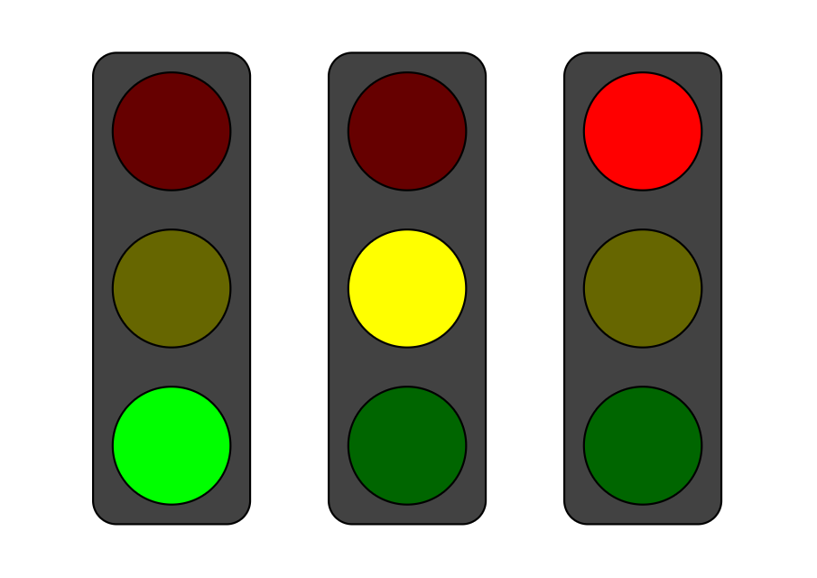

You pull up to an intersection after having just missed the green light. It’s a light you’ve 
driven through many times, so you know you’ve got about a minute before it changes. Without 
fail, a minute passes and the light changes from red to green, and you continue on your way! 
On to the next one….

There’s a lot of things in life that are predictable like stoplights. Kettles and coffee machines 
providing your morning dose of energy, starting your car and putting it into gear, the elevator 
in your apartment or office building. Alright maybe the car example is debatable depending on 
how old your car is. But the point is that there are a ton of things around us in our everyday 
life that always move through known steps or phases, and always take the same actions to get them 
there. Building and maintaining these systems would also be quite hard if these phases and actions 
weren’t clear. For instance if every morning you went to turn on your coffee machine, and it 
randomly chose between three buttons, but only one of those buttons would work on a given day.

In computer science we can represent these systems in a more formal way, as something called State 
Machines or in our case above and in this article Finite State Machines. It sounds fancy, but 
they really just help us to describe and work with any system in a way that makes it easier on 
our brains and our software.

In this article we’ll dig into Finite State Machines (FSMs) at an introductory level. By the 
end of the article you will understand what they are, how to represent them, and some tools 
that will help you define and visualize them.

This article will provide some code in PHP 8.0, but could be generalized to 
any language, and a lot of the introduction just deals with understanding from a visual perspective. 
So feel free to read on no matter your level!

## State Machines and Traffic Lights


Traffic lights are a nice example when working with state machines, as they’re something we’re 
all familiar with.

Let’s start with a common traffic light you might find in North America, As everyone knows Green 
means go, Red means stop, and Amber to stop if you can safely do so (or just drive faster to 
make the light). A Flashing Red is also sometimes shown which means to treat an intersection 
like four way with stop signs.



If we put ourselves in the shoes of the people who had to build these, we could envision using 
a Finite State Machine to represent the stoplight. We stick finite on the front state machine 
because there are a finite (set number) of states (colours) that the traffic light will 
transition between. There are also a finite number of actions or triggers (traffic light timers) 
which are then used to transition between the states.

Let’s go back to the image and fill it out explicitly.


Now you’ve learned about your first Finite State Machine! We’re going to go a lot deeper down 
the rabbit hole, but this will serve as a nice stepping off point.

## The Potential of State Machines

Before we dig in further I will outline some of the benefits state machines can give to you, your 
team, or your codebase. You can even use state machine representations to better understand 
systems within a product or even a UI design.

- Knowing the states and actions up front will force you to have 
a better understanding of the systems you’re creating. So clarity in terms of structure 
and scope are two things state machines will give you.

- For those who are programmers, I’m sure you can envision a codebase that had far to many 
isDisabled, isOn, isLoading, isErrored flags littered throughout levels of nested if 
statements, and to pick a certain path you had to traverse the same minefield of conditionals 
every time. State machines help to dramatically lessen or remove this top down approach of 
decision making. So less nesting and complexity of decision making in your codebase.

- State machines exposed as public properties also serve as great mechanisms for context and 
testing. They simplify and provide a cleaner interface for users and testing mechanisms to
determine what’s going on under the hood of your API or broader system.

At this point we covered the what and the why, so let’s dig into the how and start seeing 
FSMs in practice.


## Modelling Our Own State Machines

There are a lot of finite state machine libraries which give you access to ready made and well 
tested APIs. This process is nice because they’re a great concept to break down, and building 
your own isn’t too complicated.

We’ll walk through how to model our stoplight example with an Adjacency List, State Transition 
Diagram, and a JavaScript / TypeScript interface. By doing this we will have a better idea of 
what the code looks like that drives the logic behind these systems, and gives us a clear 
visual of our system.

### Adjacency list

To start, let’s write all the possible ways our lights will transition from one colour to another. 
A simple way to do this is to put them in a table which has the available states of our system in 
one column, and the adjacent states in the other.

For instance, because a Red light will transition to a Green light, we would say it’s adjacent 
to the Green light state and the Green light is adjacent to Red.

The table below is the adjacency list for our traffic light system:

| Color         | Adjacent to                     |
|---------------|---------------------------------|
| RED           | AMBER or GREEN or FLASHING_RED  |
| GREEN         | RED or AMBER or FLASHING_RED    |
| AMBER         | GREEN or RED or FLASHING_RED    |
| FLASHING_RED  | GREEN or RED or AMBER           |

This list is harder to look at, because it doesn’t convey direction. So let’s make another which 
specifies just the states that are transitioned to.

| Colour       | Transitions to        |
|--------------|-----------------------|
| RED          | GREEN or FLASHING_RED |
| GREEN        | AMBER or FLASHING_RED |
| AMBER        | RED or FLASHING_RED   |
| FLASHING_RED | RED                   |

Note that for the FLASHING_RED colour state, we’re making a broad assumption that when the system is 
restarted it will first transition to a RED light. We’ll consider this the starting state of our 
system.

### State Transition Diagram

For simple state machines we could just skip writing out the adjacency lists, but for more complex 
systems you will probably end up writing out a version of it anyways, so it’s a useful practice.

This leads us to the State Transition Diagram, a great tool for visualizing and designing finite state machines.

For the State Transition Diagram we’re going to turn our lists above into a visual diagram, with 
circles representing our states, arrows between them indicating the transitions, and labels for the 
actions. For stoplights, the action that causes the lights to transition is often a timer, or in 
the case of the flashing red, an error signal caused by a power outage. We’ll put all this info 
into the diagram below:


State Transition Diagrams are nice because they give us a clear way to visually look at a system,
and help reveal which parts are overly complex, or where there is redundancy.

In this step we also decided on the names of the actions which cause the transitions between 
states. In the next step we’ll turn this into code!

## State Map Using Pluf/Workflow

Now that we have a state transition diagram, we will build out an object which represents it. 
We’ll then type that object using a PHP interface, and we’ll use the interface 
to help us using state machine.

First up, let’s take a look at the Pluf FSM (finite state machine) equivalent 
to above:

```php
use Pluf/Workflow/Attributes/State;
use Pluf/Workflow/Attributes/Transit;

#[State(name: 'RED')]
#[State(name: 'GREEN')]
#[State(name: 'AMBER')]
#[State(name: 'FLASHING_RED')]
#[Transit(from: 'RED', to: 'FLASHING_RED'  , on: 'SYSTEM_ERROR', callMethod: 'updateState')]
#[Transit(from: 'GREEN', to: 'FLASHING_RED', on: 'SYSTEM_ERROR', callMethod: 'updateState')]
#[Transit(from: 'AMBER', to: 'FLASHING_RED', on: 'SYSTEM_ERROR', callMethod: 'updateState')]
#[Transit(from: 'SYSTEM_ERROR', to: 'RED', on: 'SYSTEM_RESTART', callMethod: 'updateState')]
#[Transit(from: 'RED', to: 'GREEN', on: 'TIMER_EXPIRES', callMethod: 'updateState')]
#[Transit(from: 'GREEN', to: 'AMBER', on: 'TIMER_EXPIRES', callMethod: 'updateState')]
#[Transit(from: 'AMBER', to: 'RED', on: 'TIMER_EXPIRES', callMethod: 'updateState')]
class TrafficLightFSM {
	public function updateState($to, $trafficLight){
		$trafficLight->light = $to;
	}
}
```

Please notice that instead of having an action that specifies what timer we’re dealing with, we 
can generalize to have only a single TIMER_EXPIRES action.

Next we will type the object in:

```php
class TrafficLight {
	public ?string $light;
}
```

Given everything above, we now have the tools we need to represent real life systems as Finite
State Machines, and the tools to visualize them in a number of ways.

## Conclusion

Finite State Machines are a way of representing systems with a finite number of states, and a finite 
number of actions to move between those states. They help make the modelled systems clearer in terms 
of structure and scope, and generally help to simplify and reduce nesting when used in codebases.

In the next article we’ll use the above configuration and TypeScript definitions to build out a basic 
FSM abstraction, and use it to generate a running example of our traffic light state machine, along 
with some practical UI and API examples!

REDspace is a software development company that builds innovative, custom, and flexible platforms for 
global enterprises. We combine well-built backends with engaging front-end user experiences. 
redspace.com.


